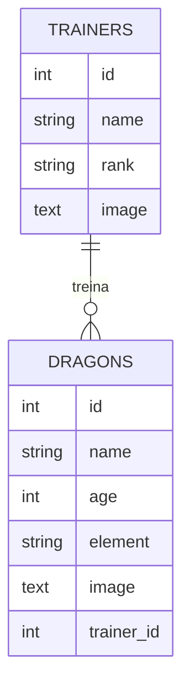

# Cadastro de Dragões e Treinadores

Aplicação web em **Laravel 11** com autenticação de usuários e CRUD completo de duas entidades relacionadas: treinadores e seus dragões. Cada dragão pertence a um treinador, e ambos podem ter imagem enviada por upload.

Projeto da Avaliação Semestral de Desenvolvimento Web · ADS · ULBRA · nov/2024.

## Funcionalidades

- Cadastro, login, recuperação de senha e verificação de e-mail (Laravel Breeze)
- Edição de perfil e troca de senha
- CRUD de **treinadores**: nome, ranking e foto
- CRUD de **dragões**: nome, idade, elemento, foto e treinador responsável
- Upload de imagens com validação de tipo (JPEG, PNG, GIF, WebP) e tamanho (até 2 MB)
- Listagem em cards responsivos, com suporte a tema escuro

## Stack

| Camada | Tecnologia |
| --- | --- |
| Back-end | PHP 8.2 · Laravel 11 (MVC, Eloquent ORM, migrations) |
| Front-end | Blade · Tailwind CSS · Alpine.js · Vite |
| Autenticação | Laravel Breeze |
| Banco de dados | SQLite (padrão) ou MySQL |
| Testes | PHPUnit (testes de autenticação e perfil) |

## Modelo de dados



## Como rodar

Pré-requisitos: PHP 8.2+, Composer e Node.js.

```bash
git clone https://github.com/gustavotrespach/as-desenvolvimento-web.git
cd as-desenvolvimento-web

composer install
cp .env.example .env
php artisan key:generate

touch database/database.sqlite   # banco SQLite padrão
php artisan migrate

npm install
npm run build

php artisan serve                # http://localhost:8000
```

Para usar MySQL, troque `DB_CONNECTION` e as credenciais no `.env` antes do `migrate`.

## Rotas principais

| Método | Rota | Ação |
| --- | --- | --- |
| GET | `/trainers` | Lista os treinadores |
| GET | `/trainers/create` | Formulário de novo treinador |
| POST | `/trainers` | Salva um treinador |
| GET | `/trainers/{id}/edit` | Formulário de edição |
| PUT | `/trainers/{id}` | Atualiza um treinador |
| DELETE | `/trainers/{id}` | Remove um treinador |

As rotas de `/dragons` seguem o mesmo padrão.

## Testes

```bash
php artisan test
```
